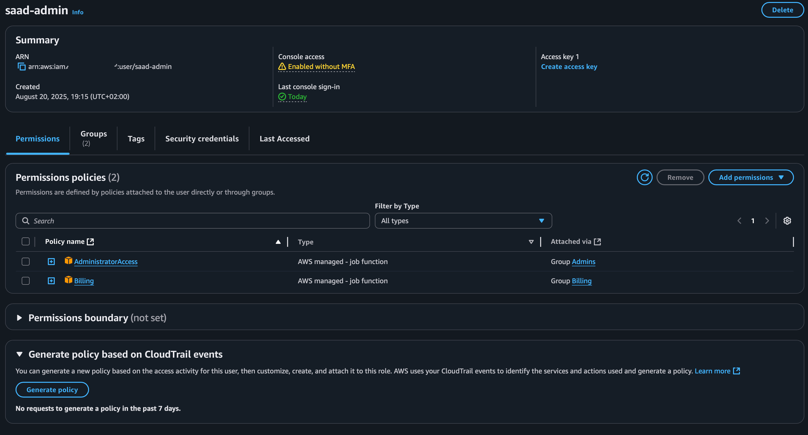

# aws-iam-user-setup

Set up a new **AWS IAM user** with secure console access, group management, and security best practices.

---

## 📌 Overview
This project demonstrates how to create an IAM user with administrative and billing permissions, organize users via groups, and implement key security measures in AWS.

---

## 🎯 Objectives
- Create a new IAM user with **console access**.  
- Create a new IAM group called **Admins**.  
- Attach the **AdministratorAccess** managed policy to the group.  
- Add the new user to the **Admins** group.  
- (Optional) Create a **BillingAdmins** group, attach **Billing** or **AdministratorAccess** policy, and add the user.  
- Enable **MFA** for the root user.  
- Apply a **strong IAM password policy**.

> ✅ The IAM user now has **two sets of permissions**: Admin access via the `Admins` group and billing permissions via the `BillingAdmins` group.

---

## 🛠 Steps
1. Sign in as **root user**.  
2. Go to **IAM → Users → Add users** → Enter username and enable **Console access**.  
3. Create **Admins group** → attach **AdministratorAccess** policy.  
4. Create **BillingAdmins group** → attach **Billing** or **AdministratorAccess** policy.  
5. Add the new user to both groups.  
6. Enable **MFA** for root user under **Security credentials**.  
7. Set up **IAM password policy** for strong passwords.

---

## 📸 Proof / Screenshot

---

## 🔗 References
- [AWS Docs – IAM Users](https://docs.aws.amazon.com/IAM/latest/UserGuide/id_users.html)  
- [AWS Docs – IAM Groups](https://docs.aws.amazon.com/IAM/latest/UserGuide/id_groups.html)  
- [AWS Docs – IAM Password Policy](https://docs.aws.amazon.com/IAM/latest/UserGuide/id_credentials_passwords_account-policy.html)
